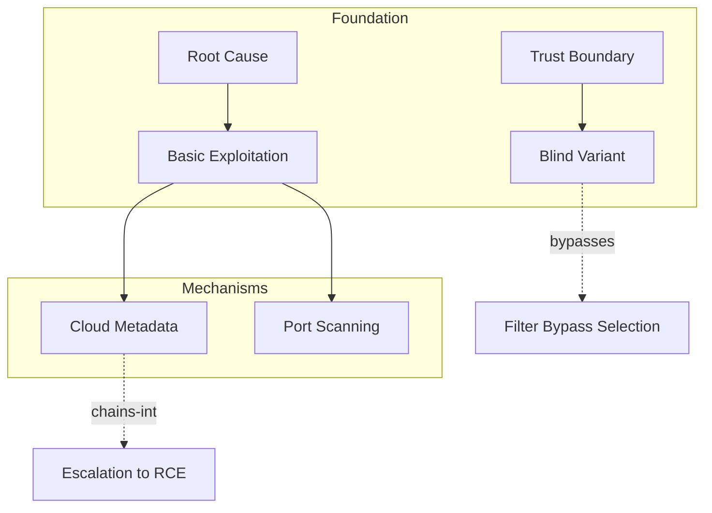

# Concept Map

Read ALL finalized artifacts. Build the structure no single artifact shows.

---

## Part 1 — Concepts by Layer

**Foundation** — WHY this vuln class exists (root causes, trust boundaries, parser behaviors)
**Mechanism** — HOW exploitation works (techniques, protocol behaviors)
**Application** — WHEN to use technique X vs Y (platform knowledge, detection)
**Judgment** — WHAT when the obvious approach fails (bypasses, chains, creative pivots)

Extract 20-40 concepts. Group by layer.

---

## Part 2 — Relationships

For each meaningful connection:

**[A] → [B]** | Edge: depends-on / enables / chains-into / bypasses / competes-with / signals
One sentence: HOW and WHY.

Prioritize non-obvious. "URL parser differentials between WAF and backend create bypass opportunities because they disagree on what a valid IP looks like" > "SSRF enables metadata access."

---

## Part 3 — Tensions (minimum 3)

**Tension: [Name]**
- A pushes toward: ___
- B pushes toward: ___
- When A wins vs when B wins
- What breaks if you pick wrong

---

## Part 4 — Mermaid Diagram



Foundation=red. Mechanism=blue. Application=green. Judgment=purple.
Solid=dependency. Dashed=signal/bypass. Labels on edges.

---

## Part 5 — Learning Path

```markdown
### Week 1 — Foundations (Artifact 00)
1. [Concept] — why it matters
**Lab:** [PortSwigger lab to validate]

### Week 2 — Core Techniques (Artifact 01)
...
```

Write to `maps/concept-map.md` + `maps/concept-map.mermaid`.
