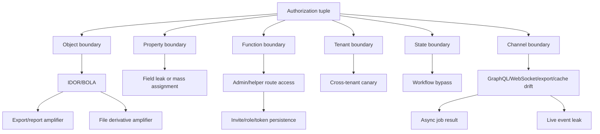

# Access-Control Gadget Concept Map

## Concepts by Layer

Foundation:
- Subject, action, object, field, tenant, state, channel, scope.
- Horizontal access, vertical access, context-dependent access.
- BOLA/IDOR, BOPLA, BFLA, business-logic authorization.
- Tenant isolation and channel consistency.

Mechanism:
- Direct object IDs.
- Parent/child relationship checks.
- Field-level serialization and mass assignment.
- Workflow transitions and state machines.
- Async job context.
- GraphQL resolver paths.
- WebSocket message actions.
- CDN/cache keys.
- File derivative services.
- Legacy route drift.

Application:
- Search/list to detail chains.
- Detail to export/report chains.
- Metadata to file derivative chains.
- Node resolver to nested field chains.
- Channel subscribe to synthetic event chains.
- Legacy endpoint to modern object chains.
- Role/invite/share/token persistence chains.

Judgment:
- Use canary objects.
- Prove one boundary at a time.
- Avoid broad enumeration.
- Prefer reversible state changes.
- Report the amplifier, not only the low-impact quirk.

## Relationships

- Object ID -> BOLA: direct references enable object-boundary testing when the server accepts user-supplied IDs.
- BOLA -> export/report: one unauthorized object can become a bulk artifact if the export path reuses weak filters.
- Parent object -> child object: child routes inherit security from the parent only if the server checks that relationship.
- Field -> BOPLA: the object can be allowed while a property remains forbidden.
- Function -> BFLA: a route can be guessed or method-swapped even when object ownership is not the main issue.
- Tenant -> cache key: cache entries must vary by tenant or they can cross data boundaries.
- REST -> GraphQL/WebSocket: alternative channels must enforce the same policy tuple.
- Workflow state -> race/replay: valid actions become invalid when order, time, or single-use semantics are skipped.

## Mermaid

